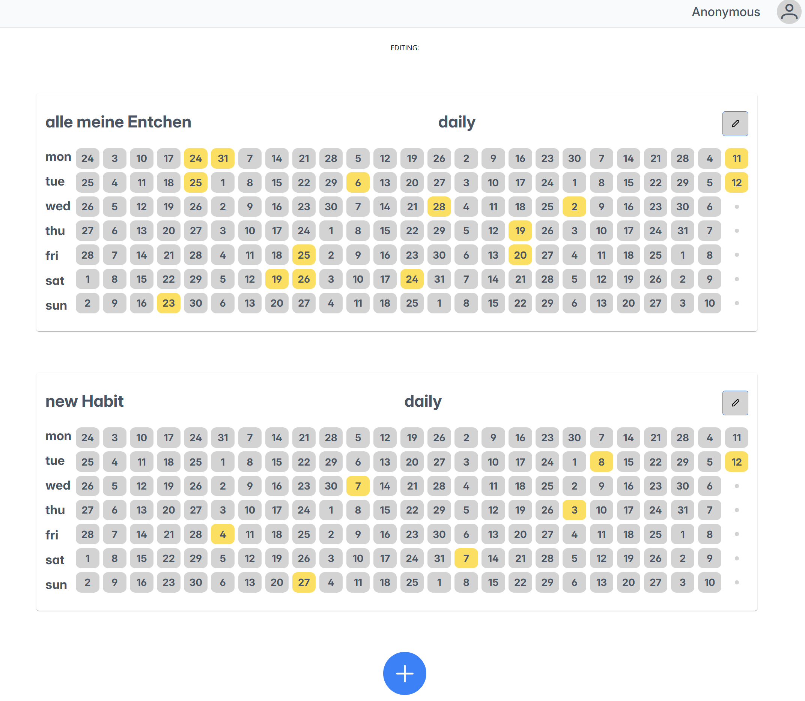

# HabitTracker 🗓️

A simple habit tracker to create habits, edit user data, and mark completed days on a calendar.

## Features
- Add new habits
- Edit username & email
- Click a date to mark a habit as completed
- SQLite database

## Currently Not Working
- Deleting habit entries

## Screenshot

## Tech Stack
Frontend: React + TypeScript + Axios  
Backend: Node.js + Express  
Database: SQLite

## Lessons Learned
- Not enough initial planning
- Plan mappers and type safety from the start and stick to it
- Don’t overuse TSX, it becomes hard to read
- Move more styling into CSS
- Plan React components ahead of time
- Design and document APIs first
- use ORM

Project time: 2 weeks  
time spent: approximately 18 hours
